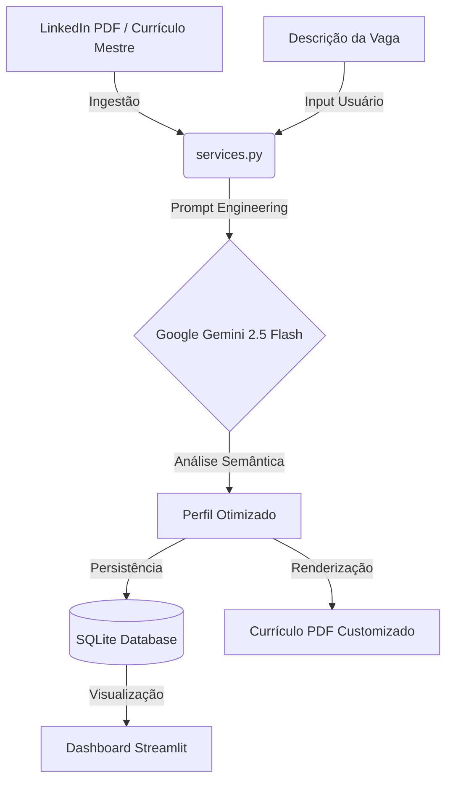

🤖 Curriculator Ecossistema de Automação de Carreira: Da Análise Semântica de Vagas à Gestão de Candidaturas.

Este projeto é uma solução de Engenharia de Software e Data Analytics desenvolvida para automatizar a personalização de currículos técnicos. Utilizando Inteligência Artificial (LLM), o sistema analisa requisitos de vagas em tempo real e gera documentos otimizados, mantendo um pipeline de dados estruturado para gestão de carreira.

🛠️ Stack Tecnológica Interface: Streamlit (UI Interativa e Dashboard de KPIs)

Inteligência Artificial: Google Gemini 2.5 Flash API (NLP e Análise de Requisitos)

Linguagem & Processamento: Python 3.10+ com Pandas para manipulação de dados

Banco de Dados: SQLite (Persistência relacional de candidaturas e status)

Visualização de Dados: Plotly (Gráficos dinâmicos de volume diário)

Engine de PDF: xhtml2pdf (Geração de documentos via templates HTML/CSS)

🏗️ Arquitetura Modular (Separation of Concerns) O software foi projetado com uma arquitetura modular para garantir escalabilidade e fácil manutenção:

app.py: Gerencia o estado da aplicação, interface do usuário e o dashboard de controle.

database.py: Camada de persistência que isola toda a lógica de comunicação com o banco de dados SQLite.

services.py: Motor de inteligência que processa prompts dinâmicos e renderiza os currículos no padrão SempreIT.

📊 Funcionalidades e Diferenciais Técnicos Análise Semântica via IA: Processamento de descrições de vagas para identificação automática de keywords e competências N1/N2/N3.

CRUD de Candidaturas: Gestão completa de registros (Inserir, Ler, Atualizar Status e Deletar) diretamente pela interface.

Segurança de Dados: Implementação de variáveis de ambiente (.env) e exclusão de arquivos sensíveis via .gitignore.

Dashboard MIS: Visualização clara de métricas como "Total Enviado", "Vagas Gupy" e "Entrevistas" para suporte à decisão.

🚀 Como Executar o Projeto

Clone o repositório:
Bash git clone https://github.com/DevBolfarini/gerador_cv.git

Instale as dependências:
Bash pip install -r requirements.txt

Configuração de Ambiente:
Crie um arquivo .env na raiz.

Adicione sua chave: GOOGLE_API_KEY=SUA_CHAVE_AQUI.

Inicie a aplicação:
Bash streamlit run app.py

Denis Bolfarini | LinkedIn | Estudante de Ciência da Computação (UNIVESP)
