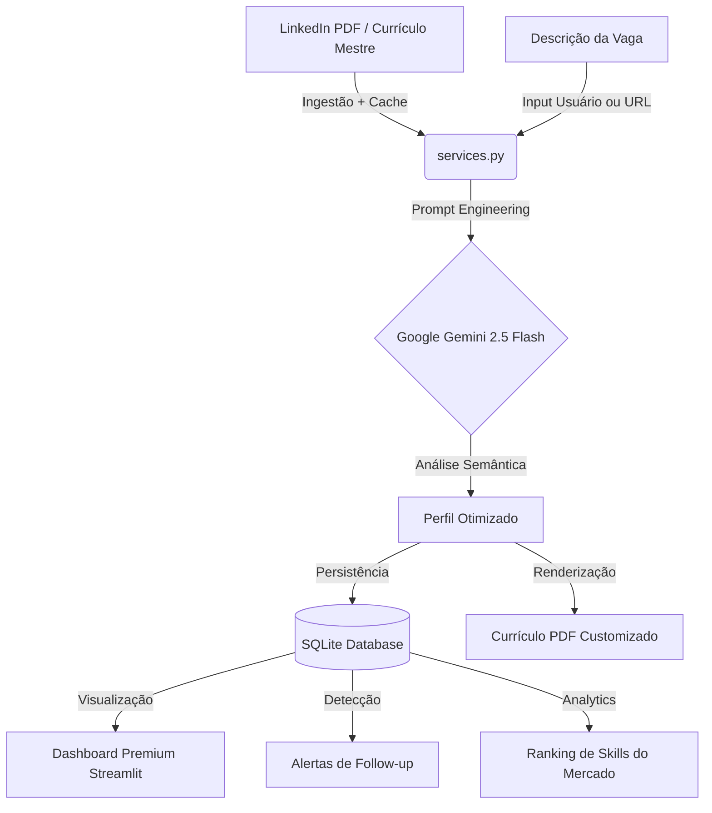

# 🤖 Curriculator — Ecossistema de Automação de Carreira

> Da Análise Semântica de Vagas à Gestão Inteligente de Candidaturas.

Solução de **Engenharia de Software e Data Analytics** para automatizar a personalização de currículos técnicos. Utilizando Inteligência Artificial (LLM), o sistema analisa requisitos de vagas em tempo real, gera documentos otimizados e mantém um pipeline de dados estruturado para gestão de carreira.

---

## 🛠️ Stack Tecnológica

| Camada | Tecnologia |
|--------|-----------|
| **Interface** | Streamlit (UI Interativa com Dashboard Premium) |
| **Inteligência Artificial** | Google Gemini 2.5 Flash API (NLP e Análise Semântica) |
| **Linguagem & Processamento** | Python 3.10+ com Pandas |
| **Banco de Dados** | SQLite (Persistência relacional com migrations automáticas) |
| **Visualização de Dados** | Plotly (Funil de conversão, skills ranking, distribuição por canal) |
| **Engine de PDF** | xhtml2pdf (Templates HTML/CSS no padrão SempreIT) |
| **Web Scraping** | BeautifulSoup + Requests (Extração de dados de vagas via URL) |

---

## 🏗️ Arquitetura Modular

O software segue o princípio de **Separation of Concerns** para garantir escalabilidade e manutenção:

| Módulo | Responsabilidade |
|--------|-----------------|
| `app.py` | Interface, Dashboard Premium com abas, KPIs e fluxo de processamento |
| `database.py` | Camada de persistência SQLite — CRUD, duplicatas, análise semanal, ranking de skills |
| `services.py` | Motor de inteligência — prompts dinâmicos, scraping de URLs, limpeza de IA, geração de PDF e follow-ups |


```mermaid
graph TD
    A[LinkedIn PDF / Currículo Mestre] -->|Ingestão + Cache| B(services.py)
    C[Descrição da Vaga] -->|Input Usuário ou URL| B
    B -->|Prompt Engineering| D{Google Gemini 2.5 Flash}
    D -->|Análise Semântica| E[Perfil Otimizado]
    E -->|Persistência| F[(SQLite Database)]
    E -->|Renderização| G[Currículo PDF Customizado]
    F -->|Visualização| H[Dashboard Premium Streamlit]
    F -->|Detecção| I[Alertas de Follow-up]
    F -->|Analytics| J[Ranking de Skills do Mercado]
```

---

## 📊 Funcionalidades

### Dashboard Premium (3 abas)
- **📊 Dashboard** — KPI cards estilizados com deltas semanais (▲/▼), funil de conversão, distribuição por canal (donut), volume diário, alertas de follow-up e **ranking de skills mais pedidas pelo mercado**
- **📝 Nova Candidatura** — Formulário inteligente com auto-preenchimento via URL, extração de requisitos e benefícios, e detecção de duplicatas
- **🛠️ Gestão** — CRUD completo com status granulares, comentários/feedback por candidatura, e visualização de detalhes (requisitos + benefícios)

### Inteligência Artificial
- **Análise Semântica** — Processamento de descrições de vagas para identificação de keywords e competências
- **3 Canais de Envio** — Gupy (Apresente-se), E-mail (PDF + texto), Currículo (somente PDF)
- **Limpeza Automática** — Remoção de artefatos de IA (saudações, CTAs, code fences)
- **Follow-up Automático** — Geração de e-mails de follow-up via Gemini para vagas sem resposta há 7+ dias
- **Extração de URL** — Cole o link da vaga e a IA extrai empresa, cargo, descrição, requisitos e benefícios automaticamente

### Inteligência de Mercado
- **🎯 Skills Ranking** — Gráfico de barras mostrando as Top 15 skills mais requisitadas em todas as vagas processadas (ex: "De 30 vagas, 15 pedem SQL, 10 pedem Python")
- **📋 Requisitos e Benefícios** — Extraídos e salvos por candidatura, com expanders editáveis
- **💬 Comentários** — Anotações livres por candidatura para registrar feedbacks de recrutadores

### Gestão de Dados
- **Cache de Upload** — PDF do currículo é enviado uma única vez por sessão (`@st.cache_resource`)
- **Detecção de Duplicatas** — Alerta se já existe candidatura para mesma empresa+cargo
- **Texto Gerado Persistido** — O texto gerado (Gupy/e-mail) é salvo no banco para referência futura
- **Status Granulares** — Enviado, Sem Resposta, Follow-up Enviado, Entrevista, Teste, Reprovado, Contratado
- **Métricas Avançadas** — Taxa de conversão, dias médio sem resposta, deltas semanais
- **Exportação Excel** — Relatório completo via sidebar

### Segurança
- Variáveis de ambiente via `.env` (API Key)
- Arquivos sensíveis excluídos via `.gitignore`

---

## 🚀 Como Executar

### 1. Clonar o Repositório
```bash
git clone https://github.com/DevBolfarini/Curriculator.git
cd Curriculator
```

### 2. Configurar Ambiente Virtual
```bash
python -m venv venv

# Windows:
venv\Scripts\activate

# Linux/Mac:
source venv/bin/activate
```

### 3. Instalar Dependências
```bash
pip install -r requirements.txt
```

### 4. Configurar Variáveis de Ambiente
Crie o arquivo `.env` na raiz do projeto:

**Windows (PowerShell):**
```powershell
echo "GOOGLE_API_KEY=SUA_CHAVE_AQUI" > .env
```

**Linux / Mac / Git Bash:**
```bash
echo "GOOGLE_API_KEY=SUA_CHAVE_AQUI" >> .env
```

### 5. Iniciar a Aplicação
```bash
streamlit run app.py
```

---

**Denis Bolfarini** | [LinkedIn](https://linkedin.com/in/denisbolfarini) | Estudante de Ciência da Computação (UNIVESP)
